# Spense for Android

**Your money, tracked by itself. Private by design.**
Bank SMS turn into entries you approve in one tap, bills split themselves among friends, and an AI that runs *on your phone* answers questions about your money. No account, no ads, no cloud.

**[⬇ Download Spense (APK)](https://github.com/vikara007/spense-releases/releases/latest/download/spense.apk)** · [All versions and what changed](https://github.com/vikara007/spense-releases/releases) · [Privacy policy](https://vikara007.github.io/spense-releases/privacy)

  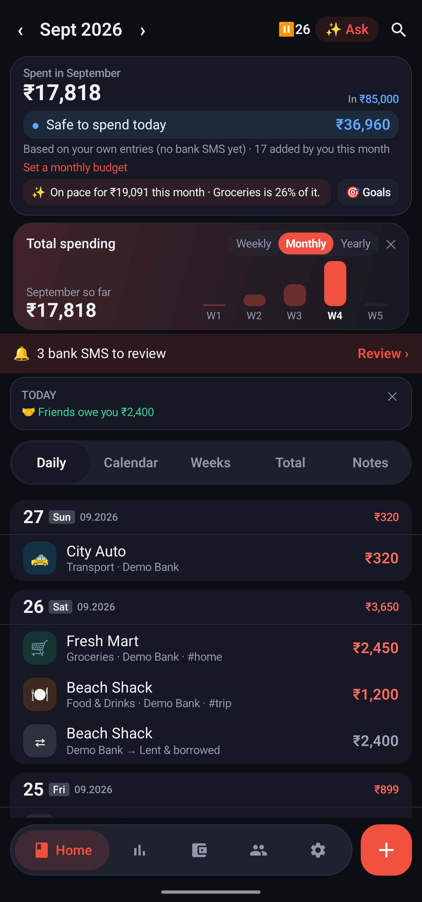
  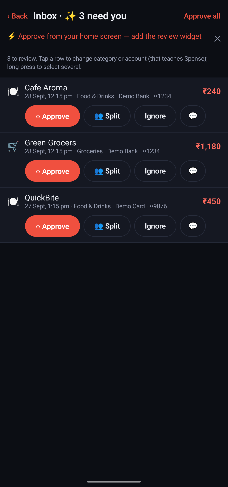
  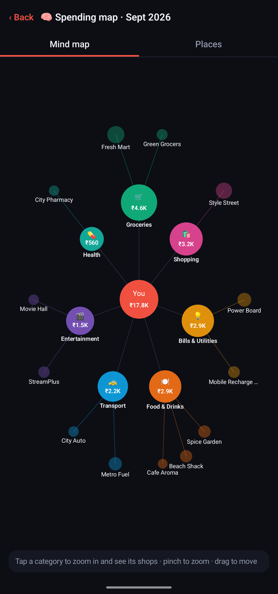
  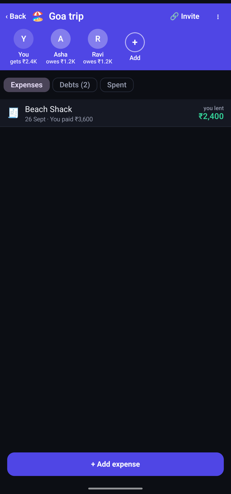

Screenshots use made-up demo data.

## ✨ Highlights

| | |
|---|---|
|  | **📩 Bank SMS become entries.** Spense reads bank, card and UPI SMS on your phone and asks *Approve?* One tap from the notification, the widget or the Inbox. OTPs and chats are ignored. Card bill payments, ATM cash and moves between your own accounts are transfers, never "spending", and refunds cancel the original. |
| 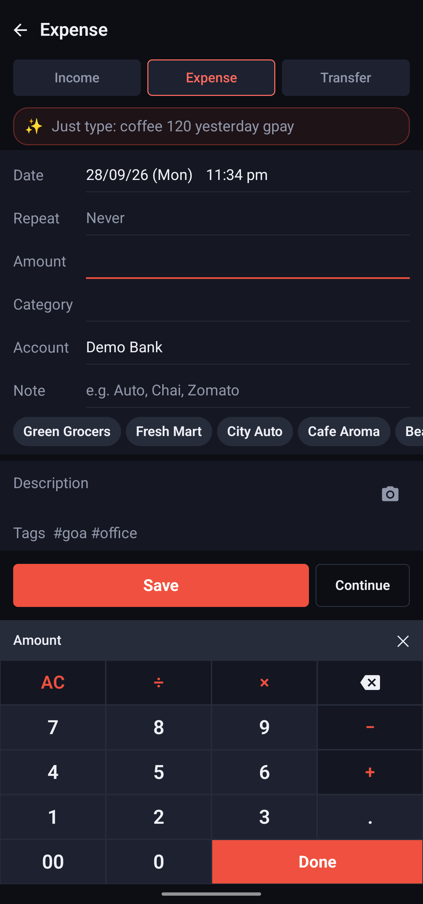 | **➕ Cash in 3 taps, receipts by camera.** Tap + → amount → category, done. A calculator keypad, quick categories on the home-screen widget, and **receipt scan**: Spense reads the receipt on the phone and fills the amount only when you tap it. |
|  | **🎯 Safe to spend today.** Home tells you how much you can spend each day so the month ends in budget, after bills, subscriptions and card dues. Budgets per category, goals to save towards, and reminders before bills are due. |
|  | **🧠 A mind map of your month.** See categories branch into shops, tap to zoom in. Every shop and purpose tag has its own page with its entries, total and trend. |
| 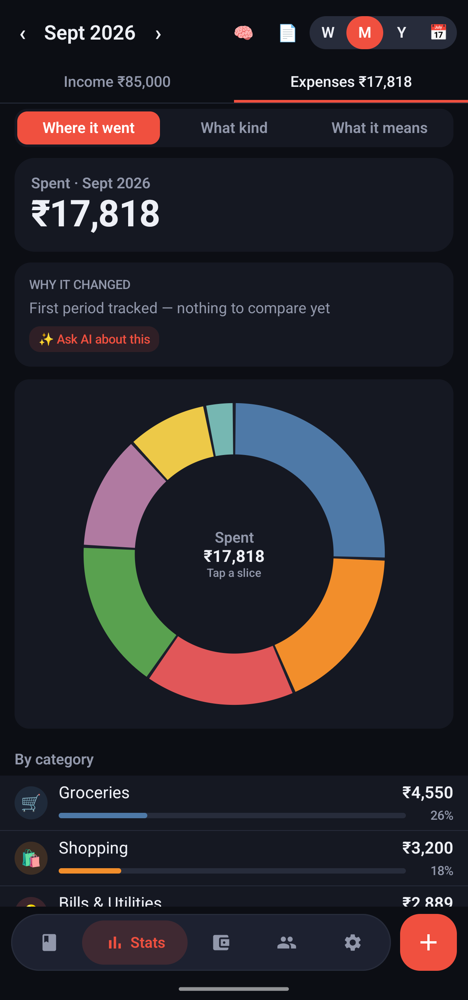 | **📊 Stats that make sense.** Where it went, what kind (needs vs wants) and what it means, month over month. Share the month as a **PDF report**. |
| 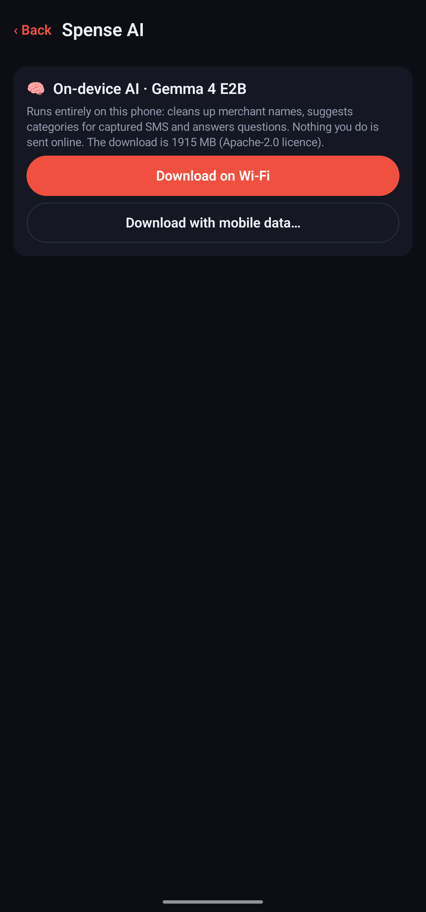 | **💬 Ask about your money.** *"How much on groceries this month?"*, *"Biggest spends in August?"*, *"Find 65"*. The AI model (Gemma, about 2 GB, downloaded once) runs **offline on your phone**, and every number comes from your own entries. |
| 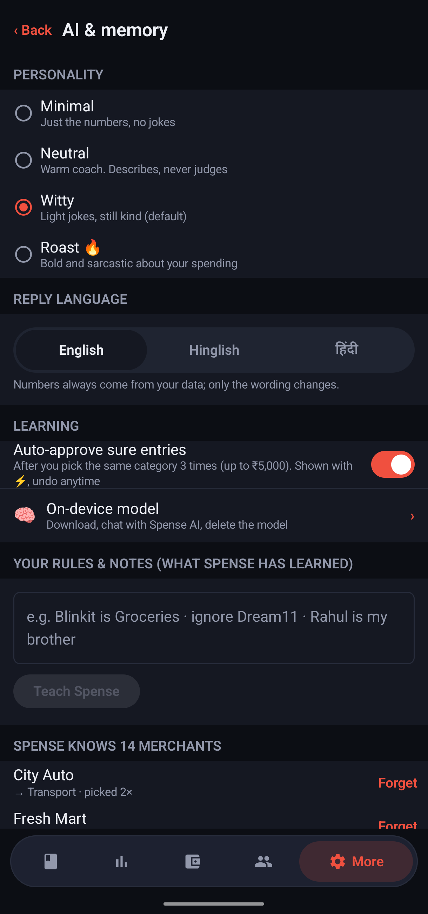 | **🪄 Teach it once.** Write rules in plain words, like *"Starbucks under ₹500 is Snacks"*, and every new entry follows. Fix one entry and tap **Apply to N similar** (with Undo). It learns your shops as you go. |
|  | **👥 Split bills with friends.** Split any payment from the Inbox, and keep groups for trips and flats with who owes whom and the fewest payments to settle. Pay by UPI. **Shared groups sync live, end-to-end encrypted.** |
| 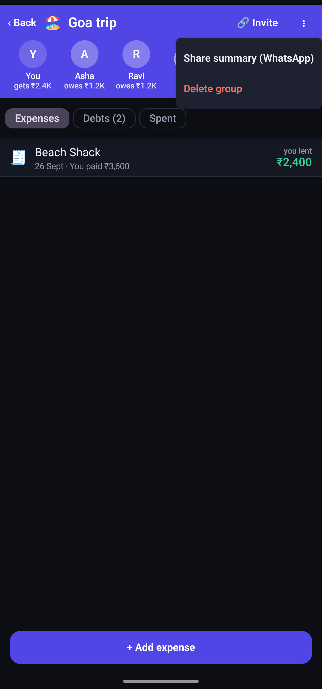 | **📤 Share details.** Send a group's balances to WhatsApp, share an invite link, or export a PDF or CSV. It goes only where you send it. |
| 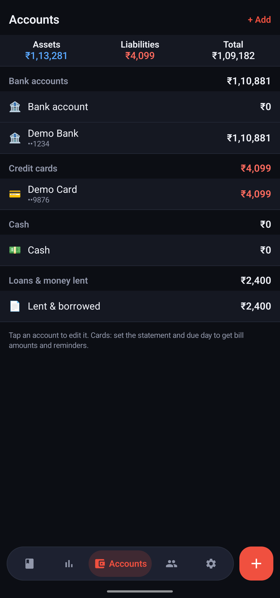 | **🏦 Accounts that add up.** Bank, cash, cards, loans and money lent, with correct balances. Future-dated entries count on their date, and there are multiple currencies and exchange rates. |
| 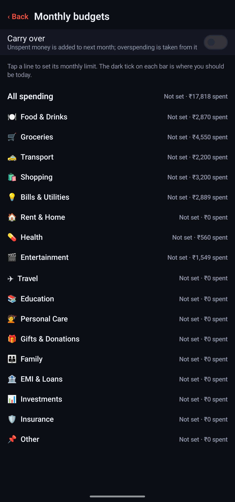 | **📅 Budgets and repeats.** Monthly limits with carry-over, repeat entries and subscriptions (rent, SIPs, Netflix), and bill reminders. |
| 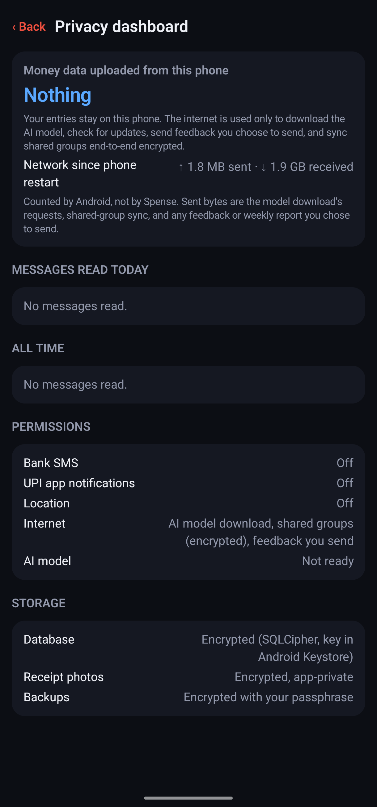 | **🔒 Private, and yours.** A privacy dashboard shows what was uploaded (nothing). There's an encrypted database, app lock, encrypted backup with your own passphrase, restore, and CSV import and export. Free forever. |

**Also:** a 1-minute feature tour on first launch, a searchable guide (Settings → Help & feedback → How to use Spense), a **What's new** note after every update, a weekly recap, calendar and weekly views, templates, home-screen widgets, dark mode, and imports from bank statements, Money Manager and Splitwise.

## Which download?
- **`spense.apk`, Spense Lite (recommended).** Installs normally. Everything works (entries, budgets, stats, splits, shared groups, the on-phone AI) except reading bank SMS: you add entries by hand.
- **`spense-full.apk`, with bank SMS auto-capture.** In India, Play Protect blocks installing apps from outside Play that read SMS, so this one may be refused. Get it from [All versions](https://github.com/vikara007/spense-releases/releases). Auto-capture for everyone comes with the Play Store version.

## Install
1. Tap the download link above on your Android phone (Android 9 or newer).
2. Open the downloaded `spense.apk`. If Android asks, allow **Install unknown apps** for your browser or file app.
3. Open Spense and follow the setup. It downloads its on-phone AI model once (about 2 GB, on Wi-Fi, or on mobile data if you choose).
4. Got a group invite link? Tap it again after setup, then **Open in Spense**.

## Updates
Spense checks once a day and shows **"Update available"** on Home (or use Settings → About → Check for updates). Install the new APK over the old one: **your entries, accounts and settings stay**. After updating, **What's new** lists what changed; it's also under Settings → About.

## Privacy in short
- Your entries, amounts, merchants, places and receipts stay on your phone, encrypted.
- Shared split groups sync end-to-end encrypted: the relay can't read them. The group key is in the invite link and never reaches any server.
- Only what you choose to send (📤 feedback, or the opt-in weekly usage counts) ever leaves the phone.

## Feedback
In the app: Settings → Help & feedback → 📤 Send.
